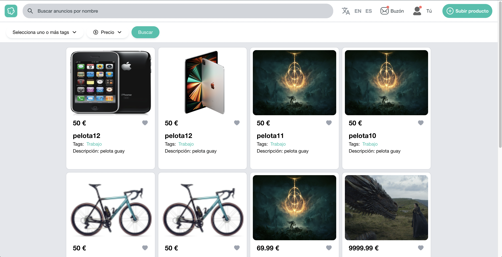

# <Wallaclone>

## Descripción

Wallaclone es una plataforma dedicada a la compra venta de productos de segunda mano entre usuarios a través de Internet. Si algo te interesa, chatea con el vendedor, queda con él o ella en la cafetería de la esquina y compra el producto.

## Índice

- [Tecnologías](#tecnologías)
- [Instalación](#instalación)
- [Uso](#uso)
- [Créditos](#créditos)


## Tecnologías

* [React](https://es.reactjs.org/)
* [TypeScript](https://www.typescriptlang.org/)
* [React Router](https://reactrouter.com/)
* [Socket.io](https://socket.io/)
* [Tailwindcss](https://tailwindcss.com/)
* [i18next](https://www.i18next.com/)
* [Vite](https://vitejs.dev/)

## Instalación

- Descargue o clone el reporsitorio:

    ```
    git clone https://github.com/Proyecto-Final-KC-2022/wallaclone-react.git
    ```
- Instale las dependencias:

    ```
    npm install
    ```

- Cree un archivo .env para las variables de entorno.


## Uso

- Para iniciar la aplicación:

    ```
    npm start
    ```

- Para visitar la aplicación:

    `http://localhost:8080/`

* Captura:

    

* Demo:

    [Wallaclone](http://wallaclone.com/)
    
## Créditos

Autores:

* Rodolfo Rodríguez - [rodorb](https://github.com/rodorb)
* Mario Filgueiras - [magallanesDev](https://github.com/magallanesDev)
* Marcelo Hornillos - [Marcemaster](https://github.com/Marcemaster)
* Emerson Balahan - [EmerBV](https://github.com/EmerBV)

---
